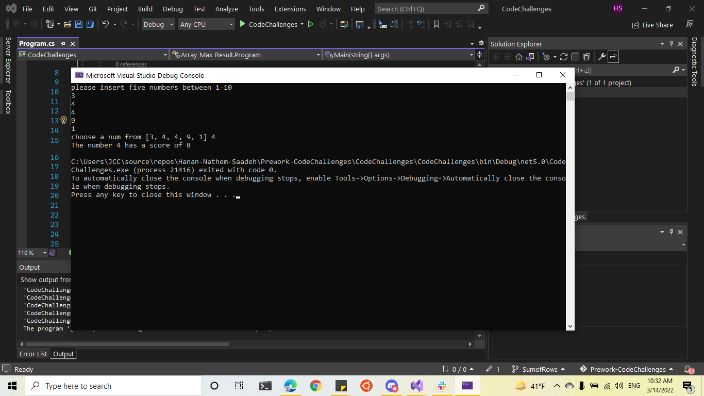
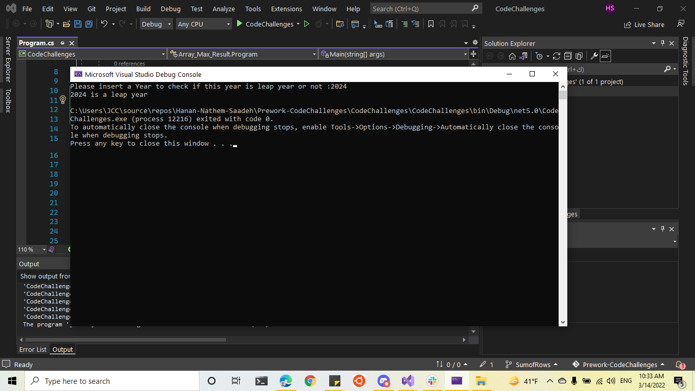
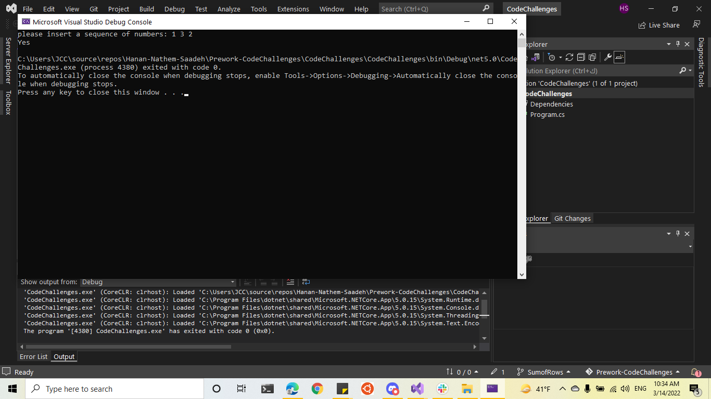
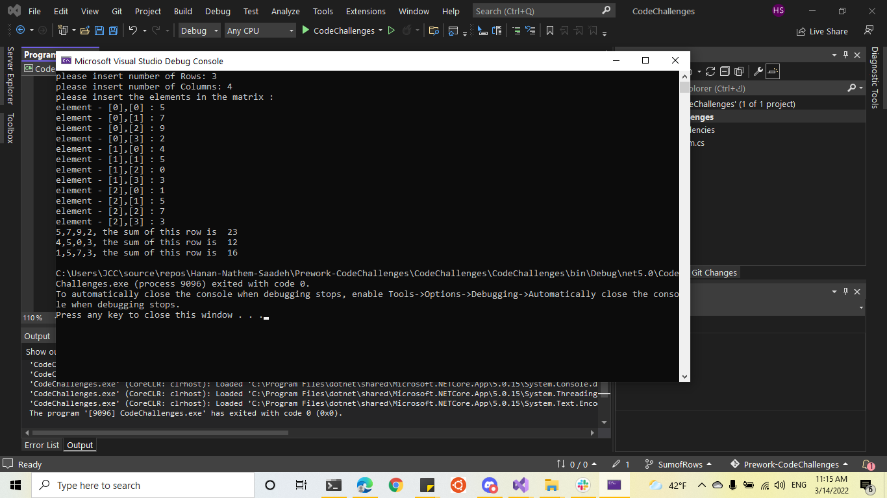

# Prework-CodeChallenges
# Array Max Result
**Instructions of Challenge**
- requests 5 numbers between 1-10 from the user
- Output the array to the console
- ask the user to select a number.
- output the “score” of the number chosen.

---
# Leap Year Calculator

---
# Perfect Sequence

---
#  Sum of Rows

